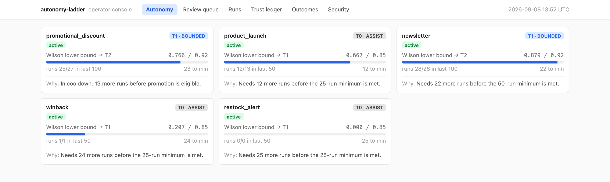
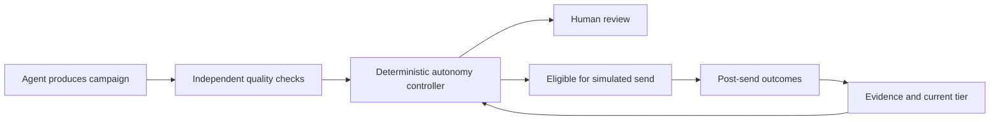

# autonomy-ladder

A framework that lets an AI agent **earn the right to act without human approval**,
per task type, based on measured performance, and lose it automatically when
performance degrades.

The reference implementation is a marketing-campaign agent for a fictional
outdoor-gear brand, but **the framework is domain-agnostic**: the autonomy
controller, the Wilson-interval promotion, the trust ledger, the two-lane review
queue, and the regression gate know nothing about marketing. Swap the agents and
the quality dimensions and the same machinery governs any agent whose mistakes are
expensive.

[Explore the design decisions](docs/adr/) · [Read the evaluation](docs/evaluation.md) · [Understand the economics](docs/economics.md)



*The running operator console with synthetic demo data: current permissions, evidence
needed for promotion, and a reason for each decision.*

## See the decision in one minute

The same campaign can require human approval at one tier and qualify for autonomous
routing at another. Permissions depend on recorded evidence and hard constraints.
The reference application simulates sending; it does not send real email.



| Evidence or event | Controller response |
|---|---|
| 10 successful runs out of 10 | Remain at Assist: insufficient evidence |
| 48 successful runs in a 50-run window | Qualify for Bounded promotion when eligible; Wilson lower bound ≈ 0.865 exceeds 0.85 |
| Critical quality failure at an elevated tier | Return to Assist and enter probation |
| Deliverability breach after a simulated send | Revoke elevated autonomy, even if pre-send checks passed |

These are implemented behaviors, with [promotion tests](tests/test_promotion.py),
[demotion tests](tests/test_demotion.py), and [outcome tests](tests/test_outcomes.py).
See the [full autonomy model](docs/autonomy-model.md) for eligibility, constraints,
and recovery requirements.

## Try the operator console without an API key

Requires Python ≥ 3.11 and [uv](https://docs.astral.sh/uv/).

```bash
git clone https://github.com/Reddytheer/autonomy-ladder.git
cd autonomy-ladder
make setup
make ui
```

Open the app. The app seeds synthetic demo state so you can inspect
permissions, review queued campaigns, follow run evidence, and trace tier changes.
The console is a local reference application; demo state is not production evidence.

To reproduce the checks without an API key:

```bash
make test         # unit tests
make eval         # authored verdicts through the controller: routing results
make gate         # fail on decision-routing regression
make judge-gate   # replay recorded LLM fixtures: judge-accuracy regression
```

Live generation and fixture recording cost API tokens. Set `ANTHROPIC_API_KEY`
in your environment (or copy `.env.example` to `.env` and fill it in), then use
`make demo` for one campaign or `make fixtures` to record evaluation responses.

## What the evidence shows

The committed evaluation separates controller correctness from judge quality:

| Check | Recorded result | What it establishes |
|---|---|---|
| Decision and review-lane routing | 75/75 authored cases | The controller routes those supplied verdicts as expected |
| Judge accuracy, faithful-render mode | 0.911 | Agreement on content rendered to preserve the test flaws |
| Claim-groundedness calibration | κ = 0.733 | Agreement with the maintainer-reviewed reference labels |
| Brand-voice calibration | κ = 0.414, below the 0.6 bar | This judge remains a known limitation |

These are synthetic evaluation results, not a production reliability claim.
Reference labels were reviewed by the maintainer, not independently labeled.
Some calibration categories have few failure examples. See
[methods, provenance, and limitations](docs/evaluation.md) and the
[committed metrics](evals/metrics.json) before interpreting the numbers.

## Product decisions worth inspecting

- **Keep permission outside the model.** The agent generates work; a deterministic
  controller owns tier transitions and routing. [Decision](docs/adr/0002-controller-outside-the-agent.md)
- **Require enough evidence to promote.** A short perfect streak does not clear the
  statistical gate. [Decision](docs/adr/0004-wilson-interval-for-promotion.md)
- **Separate unacceptable errors from quality preferences.** Critical failures block
  action; advisory scores do not. [Decision](docs/adr/0005-critical-vs-weighted-dimensions.md)
- **Keep learning after the action.** Simulated outcome failures can expose blind
  spots in the pre-send evaluation. [Decision](docs/adr/0009-post-send-outcomes-as-autonomy-signal.md)
- **Measure the evaluator separately from the generator.** A composer that corrects
  a flawed brief must not distort judge-recall measurement.
  [Decision](docs/adr/0011-separating-composer-faithfulness-from-judge-recall.md)

For the cost and risk assumptions behind the product, read [economics](docs/economics.md).
For unresolved limitations and proposed experiments, read [open questions](docs/open-questions.md).

## How it works

Two halves, kept deliberately apart (see [docs/architecture.md](docs/architecture.md)):

```
Campaign brief ─► agents/ (orchestrator-workers)         ─► RunEvaluation
                  Segment Analyst [Haiku], Copy Composer [Sonnet],
                  Catalog Lookup (tool); then independent checks:
                  Claim Verifier [Haiku] + Brand Sentinel [Sonnet];
                  evaluator-optimizer revision loop (max 2)
                                    │
                                    ▼
                  ╔═════════════════════════════════╗
                  ║  AUTONOMY CONTROLLER            ║  deterministic, no LLM
                  ║  reads state from the ledger    ║
                  ╚════════════════┬════════════════╝
                          AUTO-SEND │ REVIEW QUEUE (batch │ judgment)
```

- **Measurement**: two-stage evaluation (deterministic checks, then one LLM judge
  per dimension) with Cohen's-κ calibration against human labels.
  [docs/evaluation.md](docs/evaluation.md)
- **Graduation**: promotion on the **lower bound of the Wilson score interval**,
  not a raw streak: 10/10 does not promote, 48/50 does. Demotion + probation +
  cooldown close the loop on pre-send critical failures and post-send
  deliverability breaches. [docs/autonomy-model.md](docs/autonomy-model.md)
- **Enforcement**: the controller is deterministic code *outside* the agent. No
  LLM output can set, argue, or hallucinate its way into a higher tier (P1). Tier
  state lives only in an append-only, replayable ledger.

## The operator console

`make ui` opens a six-view console (FastAPI + vanilla JS, no build step):

1. **Autonomy dashboard**: tier per campaign type, Wilson lower bound vs the
   threshold needed, runs to promotion, probation/cooldown, and *why* each type
   is where it is.
2. **Review queue**: two lanes (batch approve vs risk-sorted judgment), SLA
   escalation, expiry.
3. **Run detail**: the full trace of one campaign: dimension scores + evidence
   and the controller decision with its reasons.
4. **Trust ledger**: the chronological audit of every tier change with the
   evidence that caused it.

5. **Outcomes**: simulated deliverability outcomes and evaluation blind spots.
6. **Security**: recorded security events for inspection.

## Key design decisions (ADRs)

1. [Orchestrator-workers over a single prompt](docs/adr/0001-orchestrator-workers-over-single-prompt.md)
2. [The controller lives outside the agent](docs/adr/0002-controller-outside-the-agent.md) (P1)
3. [Independent grading agents](docs/adr/0003-independent-brand-sentinel.md) (P2)
4. [Wilson interval for promotion](docs/adr/0004-wilson-interval-for-promotion.md)
5. [Critical vs weighted dimensions](docs/adr/0005-critical-vs-weighted-dimensions.md)
6. [Two-lane review queue](docs/adr/0006-two-lane-review-queue.md)
7. [Vendor thresholds, brand ceiling](docs/adr/0007-vendor-thresholds-brand-ceiling.md)

## Repository layout

```
src/autonomy_ladder/
  autonomy/    tiers, wilson, controller, ledger, constraints, probation  (no LLM)
  agents/      orchestrator + workers + independent checks + revision loop
  evals/       deterministic checks, judges, calibration, fixture cache, gate
  queue/       two-lane review queue, risk score, SLA
  observability/  OpenTelemetry spans + cost / routing report
  api/, web/   FastAPI backend + operator console
config/        tiers.yaml (vendor), brand_policy.yaml (brand)
data/synthetic/  catalog, customers, brand rules (fictional; generated)
evals/         goldens, adversarial, calibration, fixtures, baseline.json
docs/          architecture, autonomy-model, evaluation, open-questions, adr/
```

## Research and design references

I treat these sources as foundations for specific decisions, rather than evidence
that this implementation is production-safe. The contribution here is the product
and control design: translating measured performance into bounded permissions,
review workflows, and a recovery path. Thresholds and risk assumptions remain
project choices, documented in the design records.

### Statistical foundations

- **Edwin B. Wilson (1927), [Probable Inference, the Law of Succession, and Statistical Inference](https://doi.org/10.1080/01621459.1927.10502953).**
  The statistical foundation for the Wilson score interval used in promotion.
  Applying its lower bound to an autonomy gate is this project's design choice;
  the paper does not prescribe agent thresholds. See [ADR 0004](docs/adr/0004-wilson-interval-for-promotion.md).
- **Jacob Cohen (1960), [A Coefficient of Agreement for Nominal Scales](https://doi.org/10.1177/001316446002000104).**
  The foundation for Cohen's kappa, used to report judge agreement against the
  maintainer-reviewed reference labels. Agreement is not proof of production
  accuracy or independent labeling. See [evaluation methods and limitations](docs/evaluation.md).

### Security principles and agent architecture

- **Jerome H. Saltzer and Michael D. Schroeder (1975), [The Protection of Information in Computer Systems](https://doi.org/10.1109/PROC.1975.9939).**
  The classic formulation of complete mediation and least privilege provides
  context for keeping authorization outside the model. See [ADR 0002](docs/adr/0002-controller-outside-the-agent.md).
- **OWASP, [LLM06:2025 Excessive Agency](https://genai.owasp.org/llmrisk/llm062025-excessive-agency/).**
  Security guidance explicitly referenced in the controller design. Its emphasis
  on downstream authorization, limited permissions, and bounded functionality
  maps to the controller and hard constraints. This is guidance, not a research
  paper or a claim of OWASP certification.
- **Anthropic (2024), [Building Effective Agents](https://www.anthropic.com/engineering/building-effective-agents).**
  Engineering guidance describing the orchestrator-workers, parallelization, and
  evaluator-optimizer patterns used in the agent pipeline. The bounded revision
  loop and worker responsibilities are documented in [ADR 0001](docs/adr/0001-orchestrator-workers-over-single-prompt.md).

Separate model calls provide a useful context boundary, but they do not establish
statistically independent errors. That is why the repository reports calibration
results and known evaluator weaknesses alongside its architectural choices.

## Notes

- **Keyless reviewing is deliberate.** Controller routing uses authored verdicts;
  judge replay uses committed model responses. `make judge-gate` needs no API key.
  Recording fresh responses with `make fixtures` does. See [evaluation](docs/evaluation.md).
- **Scope** (SPEC §15): no auth, no real database (JSONL + SQLite only), no
  deployment, no Docker, no real email sending, no additional model providers.
- License: [MIT](LICENSE).
